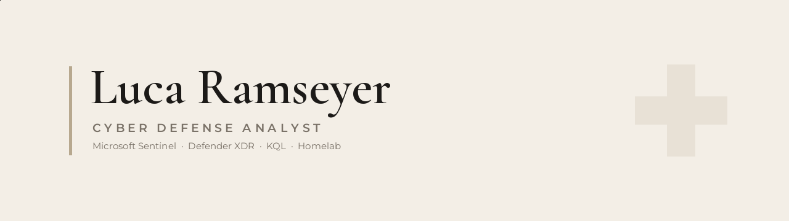

<!--
  =====================================================================
  Luca Ramseyer — GitHub profile README  (raml.ch brand)

  REQUIRED for the banner to show:
   - Commit BOTH images into an assets/ folder in THIS repo:
        assets/raml-banner-light.png
        assets/raml-banner-dark.png
   - Without them committed, the header will be blank (that was the
     blank space at the top of your profile).

  Notes:
   - <picture> swaps the banner for light/dark GitHub themes.
   - No third-party stat-card service is used anymore (those were the
     broken images). Metrics here come from shields.io, which is stable.
   - Palette: ink #1C1A18, sand #B7A88F, muted #8A8278.
  =====================================================================
-->

  <picture>
    <source media="(prefers-color-scheme: dark)" srcset="assets/raml-banner-dark.png">
    <source media="(prefers-color-scheme: light)" srcset="assets/raml-banner-light.png">
    
  </picture>

  <em>Defending the Microsoft security stack by day&nbsp;&nbsp;·&nbsp;&nbsp;breaking my own homelab by night.</em>

  
  
  

 

<h3 align="center">About</h3>

  Cyber Defense Analyst on a SecOps team in Bern, Switzerland. 
  I work across Microsoft Sentinel, Defender XDR and Defender for Endpoint — 
  detection engineering in KQL, incident response, and managed security for customers. 
  Currently studying toward a Dipl. Informatiker HF in platform development &amp; cyber security.

 

<h3 align="center">Currently</h3>

  ▹&nbsp; Detection engineering &amp; threat hunting in Microsoft Sentinel (KQL) 
  ▹&nbsp; Building SOC automation tooling in Python 
  ▹&nbsp; Running a self-hosted homelab — Linux, Docker, Ollama, Tailscale 
  ▹&nbsp; Studying toward further security certifications

 

<h3 align="center">Toolbox</h3>

  
  
  
  
  
  
  
  
  
  

 

<h3 align="center">Selected work</h3>

  <a href="https://github.com/luca-ramseyer/brand">brand</a> &nbsp;—&nbsp; design system &amp; tokens for raml.ch 
  <a href="https://github.com/luca-ramseyer/cd-report-automation">cd-report-automation</a> &nbsp;—&nbsp; SOC reporting automation 
  <a href="https://github.com/luca-ramseyer/msg-viewer">msg-viewer</a> &nbsp;—&nbsp; .msg email inspector for threat triage

 

<h3 align="center">Connect</h3>

  
  
  

 

<i>— made in Switzerland —</i>
